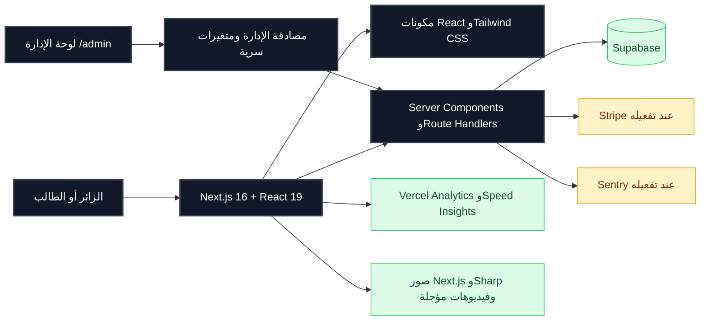
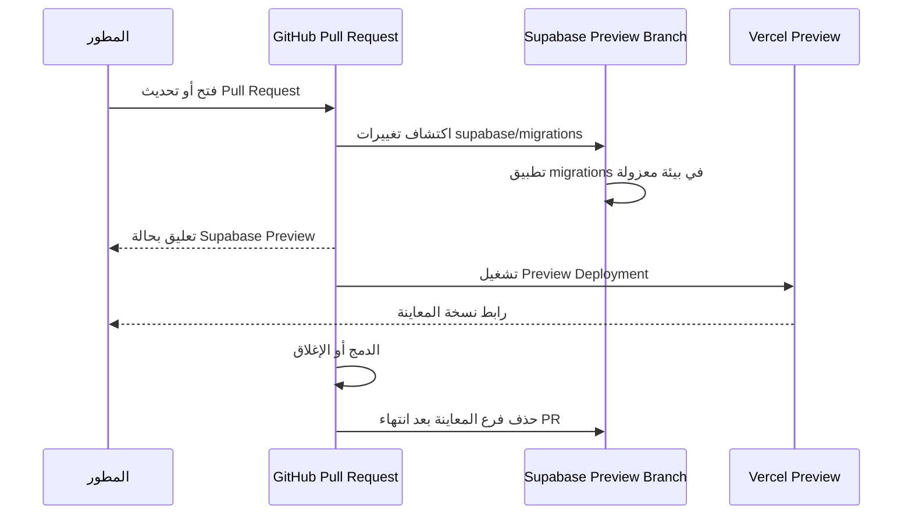

# أكاديمية الحافظ المتميز

<p align="center">
  <strong>منصة تعليمية عربية لتحفيظ القرآن الكريم وتأسيس اللغة العربية عبر الإنترنت</strong>
</p>

<p align="center">
  <a href="https://nextjs.org/"></a>
  <a href="https://www.typescriptlang.org/"></a>
  <a href="https://pnpm.io/"></a>
  <a href="https://supabase.com/"></a>
  <a href="https://vercel.com/"></a>
</p>

<p align="center">
  
  
  
  
</p>

## نبذة عن المشروع

**أكاديمية الحافظ المتميز** موقع تعليمي متجاوب يقدّم برامج تحفيظ القرآن الكريم وتأسيس اللغة العربية للطلاب والأسر. يعتمد الموقع على صفحات هبوط محلية موجهة إلى جمهور عدد من الدول، مع محتوى وباقات ورسائل تواصل مناسبة لكل سوق، ويتيح بدء التواصل والحجز عبر أزرار WhatsApp.

يركز المشروع على تقديم تجربة عربية واضحة على الهاتف والكمبيوتر، مع الحفاظ على سرعة التحميل، وإتاحة الوصول، واستقرار التخطيط، وفصل بيانات الإدارة والخدمات الحساسة عن كود المتصفح.

## المزايا الرئيسية

| المجال | الوصف |
| --- | --- |
| البرامج التعليمية | برامج لتحفيظ القرآن الكريم وتأسيس اللغة العربية، مع خيارات مدة الحصة وعدد الحصص الأسبوعية. |
| صفحات الهبوط المحلية | صفحات مستقلة للسعودية والإمارات والولايات المتحدة وكندا والمملكة المتحدة وأستراليا وألمانيا، مع محتوى وعملة ومسارات مناسبة لكل دولة. |
| التواصل والحجز | رسائل WhatsApp مُهيّأة ببيانات البرنامج والباقات والمدة والسعر، مع إمكانية إرسال بيانات الطالب والوقت المناسب للحصة التجريبية. |
| الفيديوهات | شريط فيديوهات قابل للتمرير، مع تأجيل إنشاء YouTube iframe حتى يتفاعل المستخدم لتقليل التحميل الأولي. |
| الأسئلة الشائعة | عناصر FAQ قابلة للفتح والإغلاق، بمحتوى مرتبط بالبرنامج والعمر والمواعيد والحجز. |
| لوحة التحكم | مسارات ومكونات إدارية لإدارة أجزاء الموقع، مع حماية تعتمد على متغيرات بيئة سرية. |
| SEO | Metadata وCanonical وOpen Graph وTwitter metadata، إلى جانب Sitemap وrobots.txt. |
| المراقبة والتحليلات | تكاملات اختيارية مع Sentry وVercel Analytics وVercel Speed Insights عند ضبط إعداداتها. |

## خريطة صفحات الموقع

```mermaid
flowchart TD
    HOME[الصفحة الرئيسية] --> ABOUT[عن الأكاديمية]
    HOME --> PROGRAMS[البرامج التعليمية]
    HOME --> TRUST[المعلمون والمراجعات]
    HOME --> RESOURCES[المكتبة والمدونة]
    HOME --> ENGAGE[الألعاب ولحظات الفصول]
    HOME --> CONTACT[التواصل والحجز]
    HOME --> COUNTRY[صفحات الدول]
    HOME --> ACCOUNT[الحساب]
    HOME --> ADMIN[لوحة التحكم]

    PROGRAMS --> QURAN[تحفيظ القرآن /quran]
    PROGRAMS --> ARABIC[تأسيس العربية /arabic]
    TRUST --> TEACHERS[المعلمون /teachers]
    TRUST --> REVIEWS[المراجعات /reviews]
    RESOURCES --> LIBRARY[المكتبة /library]
    RESOURCES --> BLOG[المدونة /blog]
    ENGAGE --> GAMES[الألعاب /games]
    ENGAGE --> MOMENTS[لحظات الفصول /moments-classroom]

    COUNTRY --> SA[السعودية /arabia-saudi]
    COUNTRY --> UAE[الإمارات /emirates-arab-united]
    COUNTRY --> US[الولايات المتحدة /states-united]
    COUNTRY --> CA[كندا /canada]
    COUNTRY --> UK[المملكة المتحدة /kingdom-united]
    COUNTRY --> AU[أستراليا /australia]
    COUNTRY --> DE[ألمانيا /germany]

    classDef primary fill:#0f766e,color:#fff,stroke:#115e59,stroke-width:2px;
    classDef content fill:#dbeafe,color:#172554,stroke:#2563eb;
    classDef country fill:#fef3c7,color:#78350f,stroke:#f59e0b;
    classDef admin fill:#fee2e2,color:#7f1d1d,stroke:#dc2626;
    class HOME primary;
    class PROGRAMS,TRUST,RESOURCES,ENGAGE,CONTACT,ACCOUNT content;
    class COUNTRY,SA,UAE,US,CA,UK,AU,DE country;
    class ADMIN admin;
```



## البنية التقنية



يعتمد التطبيق على تصيير الخادم عند الحاجة، ويمتنع عن تحميل الوسائط الثقيلة أو إنشاء إطارات الفيديو قبل تفاعل المستخدم. كما تم تقليل عمل مستمعات التمرير وتأجيل عرض أجزاء أسفل الصفحة، مع تصيير إحصاءات الصفحة الرئيسية من الخادم لتقليل العمل في المتصفح.

## هيكل المستودع

| المسار | المسؤولية |
| --- | --- |
| `app/` | صفحات Next.js، المسارات العامة، صفحات الدول، لوحة الإدارة، `sitemap.ts` و`robots.ts`. |
| `components/` | مكونات التخطيط والصفحة الرئيسية ولوحة الإدارة والفيديوهات والعناصر المشتركة. |
| `lib/` | إعدادات صفحات الدول والباقات وWhatsApp، المصادقة الإدارية، الأمان، الأداء، والبيانات المنظمة. |
| `public/` | الصور والملفات العامة المستخدمة فعليًا في الموقع. |
| `supabase/migrations/` | ملفات ترحيل قاعدة البيانات، وتشمل جداول CMS والفيديوهات والمدفوعات والصفحات القانونية. |
| `.github/workflows/` | سير عمل GitHub Actions، بما في ذلك فحص Lighthouse CI. |
| `docs/` | المستندات والملاحظات المساندة للمشروع. |

## المسارات المحلية

| الدولة | المسار |
| --- | --- |
| السعودية | `/saudi-arabia` |
| الإمارات | `/united-arab-emirates` |
| الولايات المتحدة | `/united-states` |
| كندا | `/canada` |
| المملكة المتحدة | `/united-kingdom` |
| أستراليا | `/australia` |
| ألمانيا | `/germany` |

## متطلبات التشغيل

يحتاج المشروع إلى **Node.js 24** و**pnpm 10** أو إصدارات متوافقة مع إعدادات CI والنشر. يجب ضبط متغيرات البيئة المطلوبة للميزات المفعّلة قبل تشغيل مسارات Supabase أو الإدارة أو الدفع محليًا.

```bash
git clone https://github.com/alymahros25-max/v0-academy-website-development.git
cd v0-academy-website-development
pnpm install
pnpm dev
```

بعد التشغيل يصبح الموقع متاحًا عادةً على `http://localhost:3000`.

## أوامر المشروع

| الأمر | الوظيفة |
| --- | --- |
| `pnpm dev` | تشغيل خادم التطوير باستخدام Turbopack. |
| `pnpm build` | إنشاء نسخة الإنتاج. |
| `pnpm start` | تشغيل نسخة الإنتاج بعد البناء. |
| `pnpm lint` | تشغيل ESLint. |
| `pnpm exec tsc --noEmit` | فحص TypeScript دون إنشاء ملفات مخرجات. |

يوصى بتشغيل فحوص الجودة قبل فتح Pull Request:

```bash
pnpm exec tsc --noEmit
pnpm run lint
pnpm run build
```

## متغيرات البيئة

أنشئ ملف `.env.local` محليًا، ولا ترفع قيم الأسرار إلى Git أو GitHub Issues أو Pull Requests أو لقطات الشاشة. قد تستخدم الميزات المفعّلة المتغيرات التالية:

| المتغير | الاستخدام | مستوى الحساسية |
| --- | --- | --- |
| `NEXT_PUBLIC_SUPABASE_URL` | رابط Supabase العام | عام للتطبيق |
| `NEXT_PUBLIC_SUPABASE_ANON_KEY` | المفتاح العام للعميل | عام للتطبيق، مع تطبيق سياسات RLS |
| `SUPABASE_SERVICE_ROLE_KEY` | عمليات الخادم الموثوقة | سري جدًا؛ لا يُستخدم في المتصفح |
| `ADMIN_EMAIL` | بريد الإدارة | سري |
| `ADMIN_PASSWORD_HASH` | Hash كلمة مرور الإدارة | سري جدًا |
| `ADMIN_SESSION_SECRET` | توقيع جلسات الإدارة | سري جدًا |
| `NEXT_PUBLIC_SENTRY_DSN` | مراقبة الأخطاء عند التفعيل | إعداد عام نسبيًا |
| `STRIPE_SECRET_KEY` | عمليات Stripe على الخادم | سري جدًا |
| `NEXT_PUBLIC_STRIPE_PUBLISHABLE_KEY` | مفتاح Stripe العام | عام للتطبيق |
| `NEXT_PUBLIC_PAYMENTS_ENABLED` | إظهار واجهة الاشتراك والدفع | معطّل افتراضيًا؛ لا يُفعّل إلا بعد اختبار Preview |
| `PAYMENTS_ENABLED` | السماح الخادمي بإنشاء جلسات الدفع | سري/تشغيلي؛ يجب أن يظل غير مضبوط أو `false` حتى الإطلاق |

في Vercel يجب ضبط القيم المناسبة في بيئتي **Production** و**Preview** كلٌ حسب حاجته. لا تضع مفاتيح الخدمة أو مفاتيح Stripe السرية في متغيرات عامة أو داخل مكونات العميل.

### حالة الدفع الحالية

الدفع مجهّز من ناحية الجداول والخدمات والـ webhooks، لكنه **مخفي ومعطّل افتراضيًا**. لا تظهر أزرار الاشتراك ولا تُنشأ جلسات Stripe أو Paddle ما لم يتم ضبط متغيري `NEXT_PUBLIC_PAYMENTS_ENABLED=true` و`PAYMENTS_ENABLED=true` صراحةً. راجع `MULTI_PROVIDER_PAYMENTS.md` و`STRIPE_SETUP.md` قبل أي تفعيل.

## قاعدة البيانات وSupabase Preview

توجد migrations داخل `supabase/migrations/`، ويجب تطبيقها بالترتيب عند تحديث بنية قاعدة البيانات. عند تفعيل GitHub Integration وAutomatic Branching في Supabase، يمكن إنشاء فرع معاينة معزول لكل Pull Request يحتوي على تغييرات قاعدة بيانات.



إذا ظهر فحص **Supabase Preview** بحالة `Skipped`، فتحقق من أن GitHub Integration مفعّل، وأن المستودع ومجلد العمل مضبوطون على المستودع الحالي ومجلد `.`، وأن خيار الاقتصار على تغييرات Supabase لا يمنع الفحص في نوع الـ PR الذي تختبره. لا تُنشئ migration وهمية لمجرد إزالة علامة `Skipped`.

### تدفق المحتوى بين Supabase والكود ولوحة التحكم

تستخدم الصفحات المرتبطة مصدرًا واحدًا للحقيقة: تكتب لوحة التحكم عبر مسار إداري محمي، وتقرأ الصفحات العامة عبر مسار عام يحدد السجلات النشطة فقط. حاليًا يشمل ذلك المحتوى العام عبر `site_content`، الباقات عبر `/api/admin/data?type=packages` و`/api/public/packages`، الأسئلة الشائعة عبر جدول `faq_items` وواجهتي `/api/admin/faq` و`/api/public/faq`، والصفحات القانونية عبر `legal_pages` و`/api/public/legal`.

عند إضافة جدول أو نوع محتوى جديد، أنشئ Migration مرقمة في `supabase/migrations/`، وأضف RLS للقراءة العامة أو إدارة المشرفين حسب الحاجة، ثم أنشئ مسار API إداريًا محميًا ومسار قراءة عام محدودًا، وبعد ذلك اربط لوحة التحكم والصفحة العامة بالعقد نفسه. لا تعدّل Migration مطبقة سابقًا؛ أضف Migration جديدة، واختبر `tsc` و`eslint` و`git diff --check` قبل رفع الفرع. يجب أن تتضمن الصفحة fallback واضحًا عند غياب البيانات، وأن تستخدم `revalidate` أو إعادة التحقق المناسبة بعد أي تعديل إداري.

لإدارة FAQ من لوحة التحكم افتح `/admin` ثم تبويب **الأسئلة الشائعة**. يمكن للمشرف إضافة السؤال والإجابة بالعربية والإنجليزية والفرنسية، تحديد التصنيف والترتيب، وتعديل أو حذف السجل. بعد الحفظ، تقرأ صفحة `/faq` السجلات النشطة من Supabase، بينما تبقى البيانات المضمنة داخل الكود fallback مؤقتًا إلى أن تكتمل عملية ترحيل المحتوى.

### عزل بيانات صفحات الدول

أُضيفت بنية مستقلة في Migration `014_site_areas_country_content.sql`، ثم زُرعت البيانات في Migration `015_seed_isolated_country_data.sql`، وأُكمل كيان الموقع الرئيسي وFAQ ألمانيا في Migration `016_seed_global_and_germany_faq.sql`. يمثل جدول `site_areas` كل كيان مرة واحدة: سجل `global` للموقع الرئيسي، وسجل مستقل لكل دولة. لا يجوز أن تستعلم صفحة دولة عن بيانات دولة أخرى أو تستخدم fallback من دولة مختلفة.

| الجدول | المسؤولية | مفتاح العزل |
| --- | --- | --- |
| `site_areas` | هوية الكيان والعملة والاسم والرابط | `id` و`slug` |
| `area_content` | نصوص ومقاطع ومحتوى الكيان | `area_id` |
| `area_packages` | الأسعار والبرامج والمزايا الخاصة بالكيان | `area_id` و`package_key` |
| `area_faq_items` | الأسئلة والإجابات الخاصة بالكيان | `area_id` و`question_key` |
| `area_links` | الروابط والأزرار ومسارات التواصل الخاصة بالكيان | `area_id` و`link_key` |

تقرأ الصفحات من `lib/country-content.ts`، ويضمن `getAreaLandingData(slug)` أن جميع الباقات والأسئلة والمحتوى والروابط قادمة من `site_area` المطلوب فقط. كما يحول `toAreaDisplayPlan` سجل الباقة إلى شكل بطاقة العرض الموحد. يوجد مسار قراءة عام موحد هو `/api/public/areas/[slug]`، ويعيد منطقة واحدة مع سجلاتها النشطة فقط.

وتستخدم لوحة الإدارة المسار المحمي `/api/admin/areas`: طلب `GET /api/admin/areas` يعرض الكيانات وسجلاتها، وطلب `GET /api/admin/areas?slug=canada` يقتصر على كندا، بينما يستعمل `PATCH` لتعديل الحقول المسموح بها في `content` أو `packages` أو `faq` أو `links`. كل طلب إداري يمر عبر `verifyAdminSession`، ولا يُسمح بتحديث حقول أو جداول خارج القائمة البيضاء. بعد أي تغيير اضغط **تحديث** في تبويب صفحات الدول أو أعد تحميل الصفحة العامة.

لإضافة دولة جديدة، أضف Migration جديدة تُنشئ سجلًا في `site_areas` وتزرع `area_packages` و`area_faq_items` و`area_content` و`area_links` مع مفاتيح فريدة داخل الكيان، ثم أضف صفحة Next.js تستدعي `getAreaLandingData` بالـslug نفسه، وأضف بطاقة المعاينة إلى لوحة الإدارة إذا لزم. لا تعدل Migration مطبقة سابقًا ولا تكرر بيانات دولة في سجل global. اختبر استعلام العدّ حسب `area_id` وتحقق من أن تحديث FAQ أو السعر في كيان لا يغير أي كيان آخر.

### هوية الطالب

صفحة `/account` تستخدم Supabase Auth الحقيقي عبر `supabase.auth.signUp` و`supabase.auth.signInWithPassword`. عند إنشاء الحساب تُحفظ `full_name` و`phone` و`account_type=student` في metadata الخاصة بالمستخدم، بينما يبقى المفتاح العام في المتصفح ويظل `SUPABASE_SERVICE_ROLE_KEY` على الخادم فقط. يجب تفعيل Email Auth وإعداد رابط التأكيد في Supabase قبل اختبار التسجيل، وعدم عرض نجاح زائف عند غياب إعدادات الاتصال.

### حالة الدفع

تبقى الباقات قابلة للعرض والحجز عبر WhatsApp، لكن الدفع الإلكتروني مخفي ومعطّل. لا تضف زر دفع في صفحة دولة ولا تجعل Migration جديدة تفعّل الدفع تلقائيًا؛ لا يُفعّل إلا بعد ضبط متغيرات الدفع صراحةً واختبار webhooks في Preview وفق `MULTI_PROVIDER_PAYMENTS.md`.

## النشر وCI/CD

يُنشر المشروع على Vercel من مستودع GitHub. فرع `main` يمثل مصدر النشر الإنتاجي، بينما تُستخدم فروع Pull Request لمعاينات مستقلة عند تفعيل التكاملات المناسبة.

تم تحديث بيئة GitHub Actions لتستخدم **Node.js 24** و**pnpm 10**. كما تم إصلاح Lighthouse CI ليبدأ خادم Next.js محليًا قبل الفحص، ومعالجة تشغيل Chrome في بيئة CI باستخدام `--no-sandbox` عند الحاجة. يجب اعتبار نجاح البناء منفصلًا عن صحة بيانات الدخول أو اتصال الخدمات الخارجية؛ اختبر كل خدمة ضمن نطاقها.

## الأداء وإمكانية الوصول

أحدث قياس Lighthouse على جهاز Moto G Power مع محاكاة شبكة 4G بطيئة سجّل النتائج الآتية:

| المقياس | النتيجة | الملاحظة |
| --- | ---: | --- |
| First Contentful Paint | 1.7 ثانية | ظهور المحتوى الأول بسرعة جيدة. |
| Largest Contentful Paint | 3.5 ثانية | الأولوية الحالية للتحسين؛ الهدف أقل من 2.5 ثانية. |
| Total Blocking Time | 60 مللي ثانية | أداء JavaScript ممتاز. |
| Cumulative Layout Shift | 0.002 | استقرار بصري ممتاز. |
| Speed Index | 1.8 ثانية | ظهور معظم الصفحة بسرعة جيدة. |

الأولوية التالية هي تحسين **LCP** عبر مراجعة عنصر Hero والصورة الأكبر والخطوط ووقت استجابة الخادم، مع الحفاظ على التحسينات الحالية الخاصة بتأجيل المحتوى، وتقليل عمل التمرير، وتثبيت أبعاد الصور، وعدم إنشاء YouTube iframe قبل تفاعل المستخدم.

يجب أن تحافظ التعديلات الجديدة على دعم `prefers-reduced-motion`، وحلقات التركيز ولوحة المفاتيح، وعناصر HTML الدلالية، وروابط `a` الحقيقية، وعدم إضافة مكتبات كبيرة لتفاعل بسيط.

## الأمن والإدارة

المسارات الإدارية موجودة تحت `/admin` وتعتمد على متغيرات بيئة سرية. لا يحتوي هذا المستودع على بريد مدير أو كلمة مرور أو hash أو session secret. يجب إبقاء أسرار الخادم خارج كود المتصفح، وعدم تسجيل كلمات المرور أو المفاتيح في Logs، ومراجعة سياسات وصلاحيات Supabase قبل تفعيل أي ميزة تعتمد عليه.

هذا README توثيق تشغيلي وليس شهادة أمان أو ضمانًا قانونيًا. ينبغي اختبار مسارات الإدارة والخدمات الخارجية في بيئة آمنة، وعدم وضع بيانات شخصية حقيقية في Fixtures أو الاختبارات.

## قواعد المساهمة

اجعل كل تغيير محدودًا وواضحًا، وأعد استخدام المكونات ومصدر بيانات الباقات بدل تكرارها بين الصفحات. قبل فتح Pull Request، اختبر الهاتف والكمبيوتر، وشغّل TypeScript وLint وBuild، وراجع الروابط وSEO، وأرفق نتائج الاختبارات التي نُفّذت فعليًا. لا ترفع الأسرار أو مجلدات البيئة أو ملفات ثنائية كبيرة أو مخرجات مؤقتة.

## الترخيص وحقوق المحتوى

محتوى الموقع وهويته ومواده التعليمية تخضع لحقوق مالك المشروع ما لم يُذكر خلاف ذلك. لا تُعد استخدام الصور أو الفيديوهات أو النصوص خارج نطاق الصلاحيات الممنوحة لك.

## روابط مفيدة

| المورد | الرابط |
| --- | --- |
| المستودع | [GitHub](https://github.com/alymahros25-max/v0-academy-website-development) |
| إطار التطبيق | [Next.js](https://nextjs.org/docs) |
| قاعدة البيانات والتفرعات | [Supabase Branching](https://supabase.com/docs/guides/deployment/branching) |
| النشر | [Vercel](https://vercel.com/docs) |
| الاختبارات والأداء | [Lighthouse CI](https://github.com/GoogleChrome/lighthouse-ci) |

---

<p align="center"><strong>حالة الوثيقة: محدثة لتعكس بنية المشروع الحالية، إعدادات Node.js 24 وpnpm 10، إصلاحات CI، وتحسينات الأداء.</strong></p>
