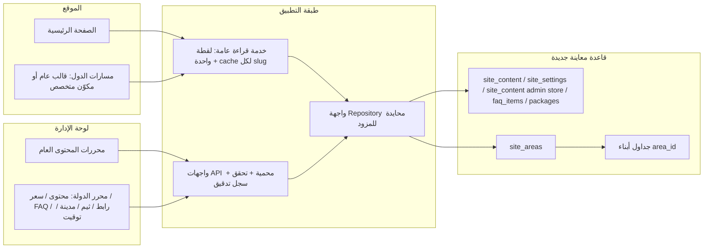

# معمارية معاينة الموقع ولوحة الإدارة وقاعدة البيانات المنعزلة

## القرار التنفيذي المقترح

- نبني **مشروع قاعدة جديدًا وفارغًا** لمعاينة الفرع، ولا نصل هذا الفرع بقاعدة Supabase القديمة ولا ننسخ منها سجلات أو أسرارًا.
- لا نعيد تشغيل ملفات `supabase/migrations/` الموجودة في جذر المشروع على القاعدة الجديدة. تلك الملفات تاريخ المستودع الحالي، وبعض أرقامها مكررة وبعضها يغيّر/يحذف بيانات؛ وهي ليست سجل ترحيل للقاعدة الجديدة.
- نبدأ بتجربة محلية تستخدم PostgREST وهميًا وبيانات اختبار اصطناعية، ثم نختبر قاعدة فعلية فارغة بعد اختيار المزود. لا يوجد أي اتصال بقاعدة خارجية أو تعديل لمتغيرات Vercel في هذه المرحلة.
- **التوصية الحالية: مشروع Supabase جديد ومعزول** هو الأسهل لهذا الفرع؛ Free يسمح بمشروعين منفصلين، لكنه لا يتيح Database Branching (يتطلب Pro). المعاينة الحالية لا تحتاج فرع قاعدة تلقائيًا: يكفي مشروع اختبار نظيف مستقل ومتغيرات Preview، ثم يقرر المستخدم لاحقًا هل ينشئ مشروع إنتاج منفصلًا أو يعيد استخدام الاختبار بعد تنظيفه.

## جرد المعمارية الحالية

### الموقع العام

- الصفحة الرئيسية: `app/page.tsx` تركّب `AcademyBanner` و`HeroSection` و`HomeContentSections` وشرائح الفيديو وCTA. تُقرأ مفاتيح المحتوى المنشور من جدول `site_content` في `lib/public-content-server.ts` مع cache/revalidate مدته ساعة؛ المكونات لها محتوى/واجهات ثابتة عند غياب البيانات.
- صفحات الدول: 40 مسارًا حاليًا، مع صفحات متخصصة لبعض الدول وصفحات تمرّ عبر المحرك/القالب المركزي. فحص المسارات الموجود يغطي الإدخال الموحد وcanonical HTML.
- طبقة الدولة: `lib/country-content.ts` تقرأ لقطة `site_areas` والجداول التابعة عبر عقد `AreaRepository` ومحول واحد؛ العرض لا يعيد استعلام الجداول. إبطال cache محصور ببلد الـslug المتأثر.
- البيانات الاحتياطية في `lib/country-fallbacks.ts` والإعدادات المتخصصة مثل النمسا وأستراليا تظل fallback/تخصيصات في الكود، لا دليلًا على محتوى قاعدة جديدة.

### لوحة الإدارة

- نقطة الإدارة الرئيسية `app/admin/page.tsx` ما زالت كبيرة وتضم layout ومبدلات الأقسام، لكن قائمة الأقسام صارت معرفة في `components/admin/admin-navigation.ts` كـregistry typed ومجمعة حسب المجال. أضيفت للقائمة الشاشات التي كانت معرفة في الرندر لكن بلا طريق للوصول إليها؛ لم نحذف أي وظيفة.
- تبويب «صفحاتنا حسب الدولة» في `CountryLandingPagesTab` يعرض الدولة/العملة، ثم الهوية والمدن والتوقيت والمحتوى والباقات والأسئلة والروابط؛ ويستخدم `/api/admin/areas` للقراءة والتعديل والترتيب وإضافة/حذف الباقات.
- توجد مسارات متوازية أو متداخلة لا تُحذف قبل جردها: FAQ العام مقابل FAQ كل دولة، الباقات العامة مقابل `area_packages`، تبويبا السعودية والإمارات مقابل مدير الدول، CMS وباني الصفحات، و«المظهر» العام مقابل ثيم كل دولة.
- الآن أصبحت صفحات الدول، محتوى الموقع العام، الإعدادات، FAQ العامة، ومخزن الباقات/المعلمين/التقييمات/الرسائل تمر عبر Repositories. أزيلت وحدة الدفع والطلبات والـcheckout من نطاق هذا الفرع مع بقاء أسعار الباقات للمحتوى والعرض؛ وملفات الدفع في `supabase/migrations/` تاريخية فقط. ما زالت وحدات أخرى مرتبطة مباشرة بـSupabase (مثل CMS pages/users/permissions/widgets، blog/legal/analytics وبعض صفحات القراءة)، وهي خارج نطاق إعادة التوصيل الحالية.
- مصادقة الإدارة تعتمد متغيرات خادمية (`ADMIN_EMAIL`, hash لكلمة المرور، وسر جلسة) وcookie موقّع. صفحة حساب المتعلم `app/account/page.tsx` تستخدم Supabase Auth؛ لذلك الانتقال إلى Neon لا يستبدل Supabase بالكامل تلقائيًا، ويتطلب إبقاء مزود Auth أو بناء/اختيار بديل وربطه.

## البنية المستهدفة: مثلث واحد واتجاهان واضحان

**القاعدة المعمارية:** العرض لا ينفذ استعلامات قاعدة. المحرر يرسل أمرًا إلى API، والـAPI يتحقق من الجلسة والمدخلات، ثم خدمة المجال تتعامل مع Repository واحد، وبعد نجاح الكتابة يعاد التحقق من Cache للمجال المتأثر فقط.

### توزيع المسؤوليات المقترح

1. `app/` — المسارات والـmetadata وواجهة الصفحة، لا استعلامات SQL مباشرة.
2. `components/` — العرض/التحرير؛ لا يعرف مزود قاعدة البيانات ولا يحمل مفتاحًا سريًا.
3. `lib/domain/areas` — أنواع ونماذج المجال والتحقق (slug، العملة، السعر، رابط التواصل).
4. `lib/repositories` — عقد القراءة/الكتابة ومحول المزود؛ لا يستورد الـUI. المحولات الحالية ما زالت Supabase، لكن الخدمات ومخازن لوحة الإدارة المعاد هيكلتها لا تستدعي SDK مباشرة.
5. `app/api/admin` و`app/api/public` — حدود HTTP، جلسة الإدارة، schemas للمدخلات، استجابات موحدة.
6. `db/isolated/` — baseline نظيف خاص بهذه المعاينة، منفصل تمامًا عن `supabase/migrations/` التاريخي في الجذر.

### مواصفات البيانات الأولية

- `site_areas`: سجل واحد لكل slug؛ `area_type`, `country_code`, `currency_code`, `currency_symbol`, `is_active`.
- `site_content`, `site_settings`, `faq_items`, `packages`, و`admin_content` مجالات عامة مستقلة؛ الباقات وFAQ العامة لا تختلط ببيانات كل دولة.
- أبناء كل منطقة يحملون `area_id` FK إلزاميًا ومؤشرًا/قيد uniqueness مناسبًا: `area_content`, `area_packages`, `area_faq_items`, `area_links`, `area_themes`, `area_cities`, `area_timezones`.
- الباقة لها سعر غير سالب وعملة/مدة/عدد حصص صريح؛ تتأكد طبقة المجال من تطابق عملة الباقة مع عملة المنطقة. لا نستنتج مدة من key عند اعتماد سجلات فعلية.
- canonical وmetadata ومحددات التخطيط تظل في route/config في الكود في المرحلة الأولى؛ لا نسمح لقاعدة البيانات بإعادة تشكيل DOM أو إدخال CSS حر.
- `admin_change_log` يسجل لاحقًا actor/resource/record والقبل/بعد. لا يسمح حذف الدولة أو تغيير slug من شاشة المحتوى العامة.
- سياسة الأمان حسب المزود تضاف في خطوة الربط: public قراءة السجلات الفعالة فقط؛ كل الكتابات من API خادمي بعد جلسة الإدارة؛ لا مفتاح service role أو `DATABASE_URL` في المتصفح.

## قاعدة البيانات والبيئات: لا ترحيل من القديم

- `db/isolated/0001_clean_baseline.sql` و`0002_admin_content.sql` تصميم إنشاء جديد فقط؛ لا `INSERT ... SELECT` من القاعدة القديمة، ولا استعادة backup، ولا نسخ مستخدمين/طلبات/فواتير. `0002` ينشئ جداول المحتوى العامة ووظيفتي الاستبدال الذري.
- `db/isolated/seed.mock.sql` بيانات اصطناعية للاختبار فقط (3 دول، عملات صحيحة لأغراض الاختبار، أسعار وأسماء واضحة بأنها Mock وروابط `example.test`). لا يصلح للعرض العام أو الإنتاج.
- ملفات `supabase/migrations/` الموجودة لا تدخل في هذا المسار. إنشاء قاعدة جديدة لا يعني إعادة تشغيل تلك السلسلة تلقائيًا؛ خصوصًا مع تكرار النسخ `022/023/026` ووجود عمليات تغيير/حذف فيها.
- لا تتغير أي Environment Variables الآن. لاحقًا نضيف متغيرات **Preview فقط** في Vercel ونثبت أن Production لم يتغير. لا تحفظ الأسرار في Git أو `.env.example`؛ لا ترسلها في المحادثة.

## اختبار العزل المقترح

1. **الآن:** اختبارات بيانات وRoute الموجودة + اختبار محلي يستخدم خادم PostgREST وهميًا داخل sandbox؛ جلسة اختبار مؤقتة، ثم GET/PATCH/POST لواجهات الدولة، CMS، الإعدادات، FAQ العامة والباقات/المعلمين، وقراءة API الدولة والصفحات.
2. **بعد اختيار المزود:** تطبيق baseline على قاعدة اختبار فارغة منفصلة، وإعادة نفس حالات الاختبار ضد اتصال الاختبار. ليس قاعدة قديمة ولا production.
3. **Preview:** ربط نشر Vercel للفرع بمتغيرات Preview فقط، ثم اختبار الصفحة الرئيسية وثلاث دول (مثل النمسا وأستراليا وكولومبيا)، والـFAQ والروابط والثيم والأسعار والعملة والـcanonical. لا دمج أو ترقية إلى Production ضمن هذا العمل.
4. **مراجعة الإدارة:** مطابقة كل تبويب مع المجال الذي يحرره. لا إزالة تبويب/صفحة حتى نعرف هل له route أو API أو مستخدم فعلي، ثم توحيد التكرار تدريجيًا.

### نتائج المحاكاة المنفذة محليًا — 2026-10-07

- `pnpm test:isolated-triangle`: **1/1 ناجح** على PostgREST وهمي مربوط بـ`127.0.0.1` فقط؛ لم يفتح اتصالًا خارجيًا ولم يستخدم إعدادات مشروع قديم.
- API الإدارة رفض الطلب دون جلسة (`401`)، ثم قبل الجلسة التجريبية؛ اختُبرت FAQ عامة CRUD، CMS content/settings، تحديث معلم وباقة عامة عبر RPC وهمي، وFAQ/باقة دولة عبر المسار المركزي.
- أثبت الاختبار أن القراءة من قاعدة جديدة فارغة لا تزرع تلقائيًا بيانات الافتراضي في `admin_content`؛ fallback القراءة لا يتحول إلى نقل/seed خفي. الكتابات الدائمة تتطلب اتصال قاعدة في الإنتاج، ولا تستخدم ملفات JSON محلية.
- API الدولة أظهر تعديل FAQ والباقة بسعر الاختبار `444` وعملة `EUR` للنمسا؛ بيانات أستراليا بقيت مستقلة بسعر `303` وعملة `AUD`.
- مسارا `/austria` والصفحة الرئيسية أعادا `200`، ظل canonical للنمسا كما هو، وظهر نص الصفحة الرئيسية التجريبي. التحقق من محتوى FAQ المعدل تم عبر API؛ لم ننفذ اختبار متصفح/تفاعل React حقيقي للوحة.
- كشف الاختبار أن صيغة `package_key` التي تضيف timestamp لا تُقرأ من محلل المدة القديم، فكانت الباقة الجديدة تُحفظ لكنها لا تظهر. عُدّل المحلل، وصار API القراءة/الكتابة يتعامل مع `duration_minutes` كحقل صريح متوافق مع baseline الجديد.
- فحوصات المسارات **3/3**، منطق بيانات الدول **7/7**، اختبار المثلث **1/1**، `lint` وTypeScript نجحت في آخر تشغيل. يجب إعادة `build` بعد آخر دفعة تعديلات. SQL baseline والبذور **لم تُشغّل** ولم تُختبر على محرك PostgreSQL فعلي لعدم وجود قاعدة/محرك اختبار في البيئة.

## مقارنة المزودين والتوصية

| المعيار | Supabase جديد | Neon جديد |
|---|---|---|
| الخطة المجانية | مشروعان منفصلان نشطان، 500MB لكل قاعدة؛ المشاريع المجانية قد تتوقف بعد أسبوع خمول. Database Branching غير متاح على Free ويتطلب Pro. | حتى 100 مشروع، 10 فروع لكل مشروع، 100 CU-hour لكل مشروع، 1GB تخزين لكل مشروع و5GB نقل بيانات وفق جدول Free الحالي. |
| ملاءمة الكود الحالي | الأعلى: `supabase-js` وPostgREST مستخدمان بالفعل، وصفحة حساب المتعلم تعتمد Supabase Auth. أسهل لتجربة هذا الفرع بقليل من إعادة الكتابة. | PostgreSQL جيد جدًا وVercel integration ينشئ `preview/<git-branch>` تلقائيًا، لكن التطبيق الحالي لا يتصل به مباشرة عبر `supabase-js`؛ يلزم استكمال محولات كل الجداول/الـAPIs وإبقاء Auth الحالي أو استبداله. |
| مسارات معاينة Vercel | ربط Vercel يدويًا بمتغيرات Preview لمشروع Supabase منفصل؛ لا يلزم تفعيل database branch لهذه التجربة الواحدة. | تكامل Neon-managed ينشئ قاعدة branch لكل deployment preview ويحقن `DATABASE_URL`؛ الميزة أوضح لو أصبح لدينا PR previews كثيرة. |
| ملاءمة الطلب الحالي | **الأفضل الآن**: قاعدة جديدة نظيفة معزولة ولا توجد هجرة/بيانات قديمة، وتتوافق مع Auth الموجود. يمكن استخدام مشروع Free مستقل للمعاينة؛ تحققوا من حد المشروعين النشطين في الحساب. | خيار جيد لاحقًا إن أصبحت أولوية إنشاء فروع تلقائية مجانية أهم من أقل تغييرات، لكن ليس الأسهل لهذا الكود. Neon ليست تابعة لـGoogle؛ هي ضمن Databricks بحسب موقعها الرسمي. |

**رأيي العملي:** ابدأوا بـ**مشروع Supabase جديد وفارغ**، وليس فرعًا من قاعدة قديمة. هذا لا يتعارض مع حد Free: لا نحتاج Branching الآن؛ صفحة الأسعار تذكر مشروعين مجانيين، بينما Branching يحتاج Pro. إن أردتم فصل Preview وProduction في آن واحد فالمشروعان المنفصلان يلائمان الخطة ما دام حد الحساب يسمح، وإلا نقرر لاحقًا طريقة نشر آمنة بدل توصيل المعاينة بقاعدة الإنتاج.

**Neon جيدة لكنها ليست الأسهل لهذا الفرع.** ميزتها الحاسمة 10 فروع مجانية وربط معاينات Vercel تلقائيًا، لكن التطبيق لا يزال يستعمل Supabase Auth للمتعلم وPostgREST/Supabase SDK في عدة وحدات لم تُحوّل بعد. لا أبدّل المزود الآن لمجرد أنها تتيح فروعًا؛ يمكن اختيارها إذا وافقتم على عمل تحويل إضافي. لا ترسلوا الأسرار في المحادثة؛ عند إنشاء القاعدة، توضع في إعدادات Vercel Preview فقط.

## مصادر رسمية

- [Supabase Docs — المكونات والخدمات](https://supabase.com/docs)
- [Supabase — Branching integrations](https://supabase.com/docs/guides/deployment/branching/integrations)
- [Supabase Pricing — Free projects and Branching availability](https://supabase.com/pricing)
- [Neon — الموقع والمنتجات الحالية](https://neon.com/)
- [Neon — Database branching](https://neon.com/docs/guides/branching)
- [Neon — Plans and free limits](https://neon.com/docs/introduction/plans)
- [Neon — التكامل المُدار مع Vercel](https://neon.com/docs/guides/neon-managed-vercel-integration)
- [Databricks — إعلان اتفاق الاستحواذ على Neon](https://www.databricks.com/company/newsroom/press-releases/databricks-agrees-acquire-neon-help-developers-deliver-ai-systems)

## استكمال المحررات المتخصصة والتحقق النهائي — 2026-10-08

- أُضيفت واجهتا `/api/cms/landing-pages` و`/api/cms/legal-pages` مع مصادقة الإدارة والتحقق الصارم عبر Zod؛ محرر السعودية والإمارات المشترك يحفظ كل إعداد على مفتاح مستقل (`saudi-arabia` مقابل `uae`).
- صفحتا السعودية والإمارات تقرآن نص الواجهة وSEO من `landing_page_configs` مع fallback typed آمن. تُحمّل لقطة بيانات كل دولة مرة واحدة ثم تُمرّر لمكونات الباقات؛ تبقى الأسعار في `area_packages` وبعملة سجل البلد، ولا تُنسخ إلى JSON التحريري. إعادة التحقق تخص مسار الدولة المحفوظ فقط.
- شاشة الصفحات القانونية تستخدم الآن API الإدارة الموثق وتدعم إنشاء ترجمة مفقودة بتحديث/إدراج آمن على `(page_slug, locale)`.
- اختبار المثلث المحلي الموسّع **1/1 ناجح**: رفض كتابة بدون جلسة، حفظ إعداد السعودية، التحقق من عدم تسربه إلى الإمارات، تطابق نص الصفحة وcanonical/SEO، وإنشاء نسخة قانونية تجريبية. لم يستخدم الاختبار قاعدة فعلية أو إعدادات إنتاج.
- التحقق النهائي: `pnpm exec tsc --noEmit` ناجح؛ اختبارات بيانات الدول **7/7**، المسارات **3/3**، عدم وجود سطح دفع **4/4**؛ `pnpm test:isolated-triangle` **1/1**؛ `pnpm build` ناجح. لا تزال قاعدة PostgreSQL الحقيقية غير موصولة، ولم تُنفذ ملفات SQL أو تُغيّر إعدادات Vercel؛ يلزم وضع الأسرار في Vercel Preview بعد إنشاء قاعدة الاختبار الفارغة، ثم تنفيذ الاختبار عليها.
