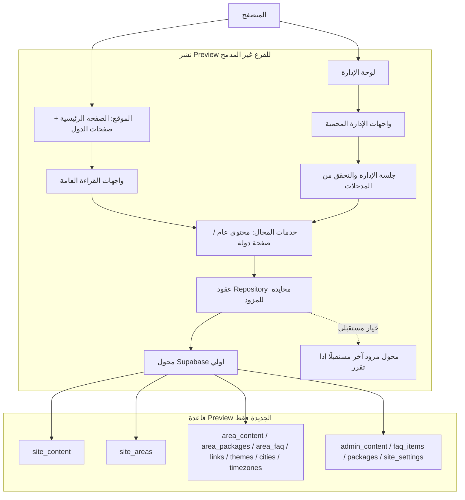
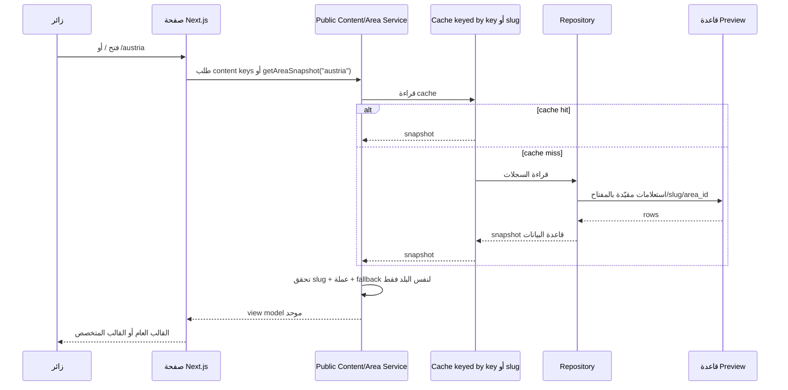
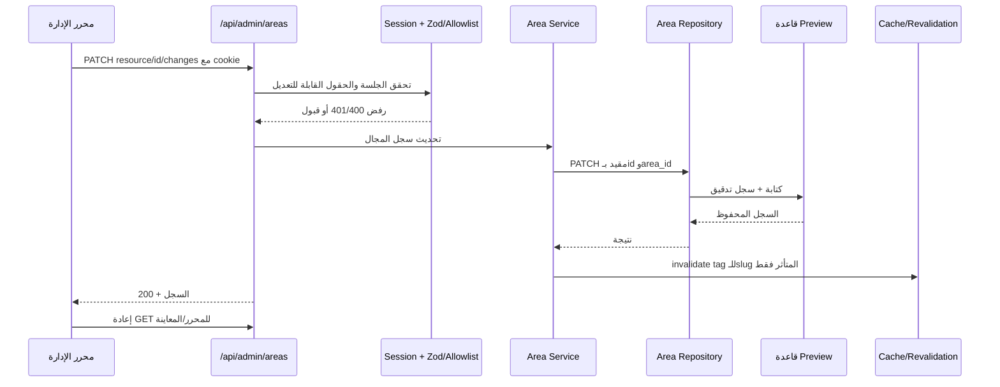
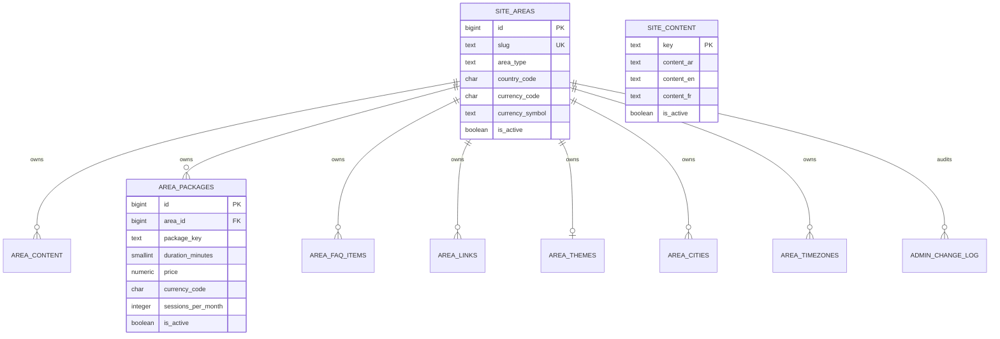

# تفصيل البنية المعمارية المقترحة

> **حالة التنفيذ بتاريخ 2026-10-07:** تم توصيل Repositories للدول ومحتوى الموقع والإعدادات وFAQ العامة ومخزن بيانات الإدارة والباقات العامة؛ وأصبحت أقسام لوحة الإدارة مسجلة في navigation registry واحد. اختبارات PostgREST الوهمي ناجحة. لم تُنشأ قاعدة فعلية بعد ولم يُشغّل SQL.

## 1. الهدف والحدود

نريد ثلاث نقاط مترابطة في **بيئة Preview منفصلة**:

1. **لوحة الإدارة**: محرر آمن للمحتوى والبيانات.
2. **قاعدة جديدة وفارغة**: مصدر الحقيقة لبيانات المعاينة فقط.
3. **موقع العرض**: يقرأ النسخة نفسها من القاعدة ويعرضها عبر قوالب الموقع.

الاتصال يكون عبر تطبيق Next.js وواجهاته الخادمية، لا اتصالًا مباشرًا من المتصفح بقاعدة البيانات. لا تُنسخ سجلات أو مستخدمون أو إعدادات من قاعدة قديمة، ولا يُعاد تشغيل `supabase/migrations/` التاريخي على القاعدة الجديدة. يغطي `db/isolated/0001_clean_baseline.sql` الموقع والدول، ويضيف `0002_admin_content.sql` FAQ والباقات ومحتوى لوحة الإدارة العام؛ الوحدات التشغيلية (الطلبات/الدفع/المستخدمون وغيرها) لا تزال بحاجة إلى جرد ومخطط مستقل.

## 2. الرسم المعماري



**الحد الحاسم:** مكونات العرض لا تعرف اسم المزود ولا تحمل سر الاتصال. المسارات والخدمات المنقولة تمر عبر Repository؛ بقيت وحدات أخرى مرتبطة مباشرة بـSupabase ومذكورة في تقرير المعمارية.

## 3. طبقات التطبيق ومسؤولية كل واحدة

| الطبقة | مكانها المقترح | مسؤوليتها | لا تفعل |
|---|---|---|---|
| المسارات والـmetadata | `app/**/page.tsx` | اختيار القالب، توليد metadata وcanonical، طلب snapshot جاهزة | لا تكتب استعلامات جداول ولا منطق عملة/باقة |
| العرض | `components/` | عرض الـsnapshot، تخصيص التصميم المميز للنمسا/أستراليا وغيرها | لا يستعلم قاعدة ولا يختار قاعدة بديلة لدولة أخرى |
| مكونات الإدارة | `components/admin/` | نموذج تحرير، حالة حفظ، رسائل نجاح/فشل، معاينة | لا يملك مفتاح DB ولا يرسل SQL أو طلبات لمزود محدد |
| API | `app/api/public/**`, `app/api/admin/**` | HTTP، جلسة، schema validation، status codes، تحديد cache | لا يكرر منطق domain في كل route |
| خدمات المجال | `lib/country-content.ts`, `lib/public-content-server.ts` | قواعد fallback، تحقق العملة، تحويل سجل إلى snapshot، cache/revalidation | لا تعتمد مباشرة على React |
| عقود المجال | `lib/domain/**` | types، المدخلات المسموحة، قواعد slug/price/currency/link/duration | لا تستورد SDK المزود |
| واجهة Repository | `lib/repositories/contracts/*` | عقود للمنطقة والمحتوى والإعدادات وFAQ والباقات/مخزن الإدارة | لا تعرف تفاصيل PostgREST أو SQL |
| محول قاعدة البيانات | `lib/repositories/supabase/*` حاليًا | تنفيذ الاستعلامات والكتابات؛ يتبدل إذا تقرر مزود آخر | لا يعرض بيانات سرية للمكوّنات |
| مخطط البيانات | `db/isolated/` | إنشاء schema نظيف وبذور اصطناعية | لا يستورد أو يعيد استعمال migrations القديمة |

### واجهات المجال التي ينبغي أن تكون مرجعًا موحدًا

```ts
interface AreaRepository {
  getAreaBySlug(slug: string): Promise<Area | null>
  getAreaSnapshot(slug: string): Promise<AreaSnapshot>
  listAreas(): Promise<Area[]>
  patchAreaRecord(input: AreaPatch): Promise<AreaRecord>
  createAreaPackage(input: NewAreaPackage): Promise<AreaPackage>
  softDeleteAreaPackage(id: number): Promise<void>
}

interface SiteContentRepository {
  getPublicContent(keys: string[]): Promise<Record<string, LocalizedContent>>
  updateContent(key: string, locale: string, value: string): Promise<void>
}
```

هذه العقود مطبقة لمجالات الموقع والدول وFAQ والباقات العامة وcollections الإدارة، وتستهلكها APIs وخدمات المجال؛ ما زالت APIs ومكتبات أخرى تستورد `supabaseAdmin` مباشرة، لذلك لم يكتمل نقل كل نطاقات الإدارة بعد.

## 4. مسارا الطلب الأساسيان

### أ. قراءة الموقع



ترتيب حل الحقول:

1. سجل قاعدة البيانات الفعلي المطابق للـslug/`area_id`.
2. fallback برمجي **للدولة نفسها فقط** عند غياب السجل/الجدول أو تعذر الاتصال.
3. لا يرجع fallback من دولة أخرى، ولا تُقبل باقة عملتها لا تطابق عملة المنطقة.
4. يبقى شكل الصفحة، `canonical`، metadata، تخطيط النمسا/أستراليا وأي اختلاف بصري مقصود في route/config أو المكوّن؛ لا تتحول قاعدة البيانات إلى محرّك HTML/CSS حر.

### ب. تحرير الإدارة



الحفظ لا يرسل نجاحًا للواجهة قبل نجاح الكتابة. إذا فشل الاتصال لا تُسقط بيانات البلد إلى دولة أخرى؛ ترجع الخدمة fallback لنفس slug على القراءة، بينما تبقى عملية كتابة الإدارة خطأ واضحًا وقابلة لإعادة المحاولة.

## 5. نموذج قاعدة البيانات الجديدة

### الرسم العلاقي



### قواعد المجال والقيود

- `site_areas.slug` فريد وثابت بعد النشر؛ `country_code` فريد للدول، و`currency_code` معتمد في السجل نفسه.
- كل جدول طفل يحمل `area_id NOT NULL` مع FK إلى `site_areas`; الاستعلام دائمًا scoped بـarea/slug، لا قراءة كل الدول في مكوّن الصفحة.
- مفاتيح السجلات مركبة منطقيًا: `(area_id, content_key)`, `(area_id, package_key)`, `(area_id, question_key)`, `(area_id, link_key)`… لمنع تكرار السجل داخل الدولة.
- `area_packages`: `price >= 0`, `sessions_per_month > 0`, `duration_minutes` صريح، والعملة مطابقة لعملة الدولة عبر domain validation وقيد/trigger في PostgreSQL.
- `area_themes`: واحد نشط للمنطقة في البداية؛ ألوان HEX محققة. المدن والتوقيت لهما keys مستقرة، ومنطقة زمنية أساسية واحدة لكل دولة.
- الروابط تسمح `https://` أو مسارًا داخليًا يبدأ بـ`/`؛ لا HTML/JavaScript عشوائي في المحتوى.
- `admin_change_log`: الفاعل، البلد، الجدول/المورد، ID السجل، الفعل، قبل/بعد JSONB وتاريخ العملية. يضاف قبل الاختبار على DB الحقيقية أو مع أول API كتابة.
- `site_content` يغطي copy المنشور للصفحة الرئيسية؛ `0002_admin_content.sql` يضيف أيضًا `site_settings`, `admin_content`, FAQ العامة والباقات العامة. لا توجد بيانات default مزروعة إلى DB بمجرد GET؛ تبقى fallbacks للقراءة فقط.
- الطلبات والفواتير والمدفوعات والمستخدمون وبيانات الطلاب ليست ضمن قاعدة محتوى المعاينة الأولى؛ لا ننسخها ولا نزرع بيانات شخصية.

المخطط الأولي موجود في [`db/isolated/0001_clean_baseline.sql`](../db/isolated/0001_clean_baseline.sql) و[`db/isolated/0002_admin_content.sql`](../db/isolated/0002_admin_content.sql)، وبيانات التجربة المصطنعة في [`db/isolated/seed.mock.sql`](../db/isolated/seed.mock.sql). لم يُشغّل أي ملف SQL على محرك PostgreSQL حتى الآن.

## 6. محاذاة أقسام لوحة الإدارة مع الموقع

| القسم الحالي | المجال الذي يحرره | الوجهة العامة/المستهلك | جداول/خدمة مقترحة | التوصية |
|---|---|---|---|---|
| `dashboard` | مؤشرات فقط | لوحة الإدارة | API analytics | فصل القراءة التحليلية عن جداول copy |
| `country-pages` | نصوص/باقات/FAQ/روابط/ثيم/مدن/توقيت كل دولة | مسارات الدول والمحرك | `site_areas` + `area_*` | المجال الأساسي لأول قاعدة معاينة |
| `saudi-landing`, `uae-landing` | تخصيصات حالية لكل صفحة | routes مخصصة/محرك الدول | نفس snapshot + config خاص | لا حذف الآن؛ دمج البيانات أولًا مع الحفاظ على التخطيط الخاص |
| `packages` | باقات عامة/عامة الموقع | صفحة الباقات والدعوات | جدول `packages` العام أو خدمة عامة | لا تخلطها مع `area_packages`؛ العملة والنطاق مختلفان |
| `faq` | FAQ عام | `/faq` وواجهات عامة | `faq_items` أو `site_content` منظم | مختلف عن FAQ الدولة؛ توحيد UI لا يعني دمج البيانات |
| `teachers`, `reviews` | بيانات مدرسين وآراء | الصفحة الرئيسية/صفحات العرض | domain مستقل | بعد أول تجربة الدول، وبلا بيانات شخصية حقيقية في Mock |
| `pages`, `pages-builder`, `cms` | صفحات وكتل عامة | مسارات الموقع | مراجعة `site_pages`, `admin_content` الحالي | مصدر التكرار الأهم؛ لا حذف قبل خريطة لكل block وAPI |
| `settings`, `theme` | إعدادات عامة ومظهر | layout/page sections | مفاتيح إعدادات محدودة ومتحقق منها | ضبط allowlist؛ لا CSS حر ولا كتابة في جدول الدولة |
| `blog`, `library`, `classroom-videos`, `educational-games` | محتوى تعلم وإعلام | routes مستقلة | repositories مستقلة لكل مجال | تُفصل عن `area_*` حتى لا تتضخم خدمة الدولة |
| `users` | مستخدمون وصلاحيات لوحة | الإدارة | نظام الهوية الحالي/مستقبلًا | إنشاء إدارة Preview من الصفر؛ لا استيراد مستخدمين قدامى |
| `messages` | رسائل التواصل والاستفسارات | APIs خارج المحتوى | مجال رسائل مستقل | يشمل بيانات التواصل فقط، ولا ينشئ طلبات أو معاملات مالية |
| `seo-guide`, `gsc-dashboard`, `request-indexing` | أدوات SEO وتقارير | Google Search Console | تكاملات خارجية | ليست مصدر الحقيقة لمحتوى الصفحة؛ metadata يبقى بالكود أولًا |

### نقاط تحتاج قرارًا أثناء إعادة الهيكلة

1. `FAQ` العام لا يساوي `area_faq_items`؛ واجهتا تحرير متشابهتان لكن المصدر والجمهور مختلفان.
2. الباقات العامة لا تساوي باقات البلد. لا نخلط السعر العام بسعر عملة محلية.
3. صفحات السعودية والإمارات قد تكون لها قيمة تصميمية؛ نشارك طبقة البيانات والـAPI، لكن لا نفرض قالبًا موحدًا على الواجهة.
4. `AdminSectionToolbar` الحالي يسمح بحفظ إعدادات شكل عامة عبر API إعدادات CMS. تُحوّل لاحقًا إلى design tokens محكومة بالقيم، ولا تسمح بتعديل DOM أو CSS غير محدود.
5. حذف باقة حاليًا حذف دائم من API؛ في البنية الجديدة نفضّل تعطيلها (`is_active=false`) مع audit، والحذف النهائي يبقى إجراءً إداريًا منفصلًا بعد تحقق واضح.
6. fallback areas بمعرّف `0` في واجهة الإدارة يجب أن تظهر كـ«بيانات محلية/للقراءة فقط» لا كأنها متصلة بقاعدة قابلة للحفظ.
7. API إدارة الثيم يحتاج إعادة فحص الحقول: الواجهة تحرر حقول المعلومة القرآنية، وPATCH يسمح بها، لكن GET الحالي لا يعيد كل هذه الحقول؛ يصلح ذلك قبل الاختبار الحقيقي.

## 7. واجهات API المستهدفة

### قراءة عامة لدولة واحدة

`GET /api/public/areas/{slug}` يعيد snapshot واحدة:

```json
{
  "area": { "id": 22, "slug": "austria", "currency_code": "EUR" },
  "packages": [],
  "faq": [],
  "content": [],
  "links": [],
  "theme": null,
  "cities": [],
  "timezones": []
}
```

- فشل lookup: `404` لمنطقة مجهولة؛ fallback page من loader حسب سياسة المسار، لا استعلامات إضافية من JSX.
- cache public حسب `slug`, لا تشارك key بين البلدان.

### واجهة الإدارة

- `GET /api/admin/areas?slug=austria`: no-store، جلسة مطلوبة، يرجع سجلات الـarea المحددة ومجموعاتها.
- `PATCH /api/admin/areas`: `{ resource, id, changes }`، `resource` من allowlist، والتحقق من الحقول/القيم قبل repository.
- `POST /api/admin/areas`: إنشاء باقة؛ يرسل المتصفح `area_id`, program, الاسم، السعر، الحصص، `duration_minutes` والمزايا. الـAPI يقرأ عملة الدولة من DB ولا يثق بعملة يرسلها المتصفح.
- `DELETE /api/admin/areas`: يفضل استبداله بـ`deactivate`؛ إن احتفظنا به فيجب أن يسجل audit ويربط التأكيد بالسجل المحدد.
- كل كتابة تسجل actor/قبل/بعد وتبطل cache للـslug المتأثر فقط.

## 8. الهوية والأسرار والعزل

### الوضع الحالي

- الإدارة تستخدم `verifyAdminSession` وcookie اسمه `admin_session`: HMAC، HttpOnly، SameSite=Strict، ومدة 7 أيام. بيانات الدخول وhash وسر الجلسة تؤخذ من Environment Variables.
- عميل Supabase الحالي في `lib/supabaseAdmin.ts` يستخدم `SUPABASE_URL` مع `SUPABASE_SERVICE_ROLE_KEY` على الخادم. الـservice-role يتجاوز RLS؛ لذلك لا تكفي RLS وحدها لحماية الكتابة، بل يلزم فحص جلسة الإدارة في API. هذا المفتاح يجب ألا يصل إلى Client Component أو HTML.

### إعداد Preview المقترح بعد اختيار المزود

| البيئة | المتغيرات | السياسة |
|---|---|---|
| Vercel Preview لهذا الفرع فقط | Supabase: `SUPABASE_URL`, `SUPABASE_SERVICE_ROLE_KEY`, `ADMIN_EMAIL`, `ADMIN_PASSWORD_SCRYPT_HASH`, `ADMIN_SESSION_SECRET` — أو Neon: `DATABASE_URL` مع adapter مناسب | قيم جديدة خاصة بقاعدة Preview فارغة؛ لا تستخدم قيم Production ولا توضع في Git |
| Vercel Production | لا تغيير | لا deploy/merge ضمن هذه المرحلة |
| المتصفح | لا service role ولا `DATABASE_URL` | يمر من خلال Next APIs فقط |

أمان إضافي قبل الإتاحة: تحقق `Origin`/CSRF للكتابات، rate-limit للدخول، تدوير session secret، سجل تدقيق، وتقييد CORS. في Supabase: RLS مع قراءة عامة للسجلات النشطة فقط وكتابة خادمية؛ في Neon: database role منفصل بأقل صلاحيات وبيانات الاتصال خادمية.

## 9. cache وإعادة التحقق

| البيانات | مفتاح التخزين | تحديث cache |
|---|---|---|
| محتوى الصفحة الرئيسية | `site-content` + keys/locale | بعد تعديل مفاتيح الصفحة الرئيسية فقط، invalidate tag `site-content` |
| snapshot دولة | `country-content:{slug}` | بعد أي تعديل لسجل المنطقة: invalidate tag الدولة وrevalidate مسارها فقط |
| بيانات الإدارة | لا cache (`no-store`) | reload من API بعد نجاح العملية |

- TTL للتخزين العام يحدد سياسة العرض؛ لكنه لا يغني عن الإبطال الفوري بعد لوحة الإدارة.
- الإبطال لا يتم قبل نجاح commit/response من قاعدة البيانات.
- عند خطأ DB، fallback من config لنفس البلد فقط؛ تسجل رسالة خادمية بدون تسريب أسرار.
- يوجد ضبط لاحق مطلوب: ربط تعديلات `site_content` في CMS بإبطال tag الصفحة الرئيسية؛ لا يكفي أن يعاد حفظها في قاعدة البيانات.

## 10. التسلسل المرحلي وبوابات القبول

### المرحلة A — التوثيق والعزل (منجزة)

- تثبيت الفرع غير المدمج وعدم المساس بـProduction.
- إضافة تصميم schema منفصل عن `supabase/migrations/` القديمة.
- اختبار محلي PostgREST وهمي: مصادقة API، CRUD لـFAQ عامة، محتوى CMS وإعداداته، تحديث معلم وباقة عامة، تعديل بيانات دولة، عزل البلدان، canonical ومخرجات الصفحة الرئيسية بعد تحديث CMS.

### المرحلة B — إنهاء العقد قبل قاعدة فعلية (منفذة جزئيًا)

- إنشاء repository interfaces وفصل الوصول لمجالات الدول/الموقع/الإعدادات/FAQ والباقات ومخزن الإدارة؛ توحيد snapshot وفحص fallback.
- بقي نقل APIs مثل CMS pages/users/permissions/widgets، blog/legal/analytics وبعض مسارات القراءة إلى repositories. أزيلت واجهات الطلبات والدفع والـcheckout من نطاق المنتج الحالي.
- إصلاح حقول `area_themes` الناقصة في GET.
- `soft delete`، audit log، `Origin/CSRF`، ورسائل واضحة عند وضع fallback.
- تدقيق كامل لصفحة الإدارة: كل tab إلى API/domain/table، وبطاقات التكرار، قبل إزالة أي قسم.

### المرحلة C — قاعدة اختبار جديدة (تنتظر إنشاء المستخدم لقاعدة جديدة)

- يختار المستخدم Supabase أو Neon، ثم ينشأ مشروع جديد تمامًا.
- يتحقق baseline على PostgreSQL نظيف، ثم تطبق بذور الـMock فقط.
- اختبار 3 دول: Colombia/COP وAustria/EUR وAustralia/AUD بقيم اصطناعية؛ تغيير سجل في واحدة لا يغير الثانية.
- الاختبارات: slug، currency/price، missing row، connection failure، FAQ/link/theme/cities/timezone، revalidation، canonical/metadata.

### المرحلة D — Vercel Preview

- ربط Environment Variables بـPreview لهذا الفرع فقط؛ التحقق يدويًا من أن Production غير متأثر.
- اختبار استجابة لوحة الإدارة والصفحات على معاينة حقيقية، مقارنة screenshots قبل/بعد، وتوثيق الاختلافات المقصودة.
- لا Merge ولا تفعيل Production حتى اجتياز البوابات وتوجيه مستقل.

## 11. اختيار مزود قاعدة البيانات

**Supabase جديد** هو المسار الأقل تغييرًا الآن: التطبيق يستخدم `supabase-js` وPostgREST، وصفحة حساب المتعلم تستخدم Supabase Auth. خطة Free تسمح بمشروعين منفصلين لكنها لا تسمح بـDatabase Branching (Pro فأعلى)؛ يكفي مشروع جديد فارغ لاختبار هذا الفرع، مع متغيرات Preview منفصلة.

**Neon جديد** يوفر 10 فروع لكل مشروع على Free وتكامل Vercel-managed ينشئ فرعًا تلقائيًا لكل معاينة، لكنه ليس drop-in بديلًا لـ`supabase-js` ولا يقدم Supabase Auth نفسه؛ يلزم استكمال تحويل APIs أو إبقاء Auth منفصلًا. Neon ضمن Databricks وليست تابعة لـGoogle. لذلك هي جيدة تقنيًا، لكنها ليست الأسهل لهذا التطبيق الآن.

مصادر المزودين الرسمية والمقارنة موثقة أيضًا في [`isolated-site-admin-db-architecture.md`](isolated-site-admin-db-architecture.md).
